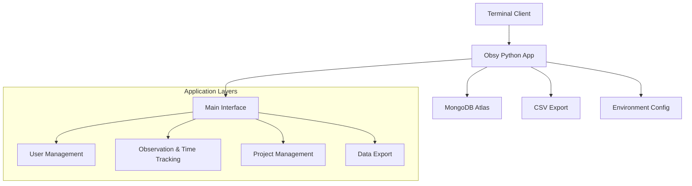

<div align="center">


<h1 align="center">🦉 Obsy</h1>
<h3 align="center">Observe your crowd</h3>

<p align="center">
<b>A modern, terminal-based employee time tracking and observation system with cloud integration</b><br>
<br>
[](https://python.org/downloads/)
[](https://mongodb.com/)
[](https://opensource.org/licenses/MIT)
[](https://github.com/psf/black)
[](CONTRIBUTING.md)
</p>

<p align="center">

</p>

<p align="center"><i>Beautiful terminal interface for observing and tracking your team</i></p>

</div>

---

## ✨ Features

- 🎨 **Beautiful Terminal UI** - Colorful, intuitive interface with ASCII art
- 👥 **User Management** - Role-based access control (Admin/Developer)
- ⏰ **Time Tracking** - Clock in/out with project assignment
- 📊 **Project Management** - Create and organize projects by domain
- 📈 **Data Export** - Export time logs, users, and projects to CSV
- ☁️ **Cloud Integration** - MongoDB Atlas for scalable data storage
- 🔐 **Secure** - Environment-based configuration for sensitive data
- 🚀 **Easy Installation** - One-command setup with virtual environment

## 🎯 Quick Start

### Prerequisites

- Python 3.7 or higher
- MongoDB Atlas account (free tier available)
- Terminal with color support

### Installation

```bash
# Clone the repository
git clone https://github.com/antrxc/aXtrLogs.git
cd aXtrLogs

# Set up virtual environment
python3 -m venv venv
source venv/bin/activate  # On Windows: venv\Scripts\activate

# Install dependencies
pip install -r requirements.txt

# Configure environment
cp .env.example .env
# Edit .env with your MongoDB Atlas connection string

# Initialize the system
python setup.py

# Run the application
python main.py
```

### First Run

1. **Admin Setup**: Create your first admin user during setup
2. **Add Projects**: Use the admin panel to create projects
3. **Add Developers**: Create user accounts for your team
4. **Start Tracking**: Developers can now clock in/out for projects

## 🖥️ Screenshots

<details>
<summary>Click to view screenshots</summary>

### Main Menu
```
       __  __ _          _             _          
  __ _ \ \/ /| |_  _ __ | |      __ _ | |__   ___ 
 / _` | \  / | __|| '__|| |     / _` || '_ \ / __|
| (_| | /  \ | |_ | |   | |___ | (_| || |_) |\__ \
 \__,_|/_/\_\ \__||_|   |_____| \__,_||_.__/ |___/

Welcome to aXtrLabs Time Tracking System
🌐 Cloud-based system - Connecting to database...

Select your role:
> Admin Panel
  Developer Panel  
  Exit
```

### Admin Panel
```
Admin Panel:
> Add User
  Remove User
  Add Project
  Export Data CSV
  View All Users
  Back to Main Menu
```

### Developer Panel
```
Developer Panel:
> Clock IN
  Clock OUT
  Project Switch
  View My Logs
  Back to Main Menu
```

</details>

## 🏗️ Architecture



## 📁 Project Structure

```
obsy/
├── 📁 commands/           # Command modules
│   ├── clock.py          # Time tracking functionality
│   ├── export.py         # Data export utilities
│   └── rbac.py           # Role-based access control
├── 📁 db/                # Database layer
│   ├── connection.py     # MongoDB connection management
│   └── model.py          # Data models and CRUD operations
├── 📁 utils/             # Utility functions
├── 📄 main.py            # Application entry point
├── 📄 setup.py           # System initialization
├── 📄 requirements.txt   # Python dependencies
├── 📄 .env.example       # Environment template
└── 📄 README.md          # This file
```

## ⚙️ Configuration

### Environment Variables

Create a `.env` file in the project root:

```env
# MongoDB Atlas Configuration
MONGO_USERNAME=your_username
MONGO_PASSWORD=your_password
MONGO_CLUSTER_URL=cluster0.xxxxx.mongodb.net
MONGO_DATABASE=obsy

# Application Settings
APP_NAME=Obsy - Observe your crowd
APP_VERSION=1.0.0
DEBUG=false
```

### Database Schema

#### Collections

| Collection | Description |
|------------|-------------|
| `users` | User accounts with roles |
| `projects` | Project definitions and metadata |
| `clock_logs` | Time tracking entries |

#### User Schema
```json
{
  "_id": "ObjectId",
  "name": "John Doe",
  "userID": "john.doe",
  "email": "john@company.com",
  "role": "dev"
}
```

#### Project Schema
```json
{
  "_id": "ObjectId",
  "name": "Website Redesign",
  "domain": "Frontend Development",
  "hours": 120,
  "status": "active"
}
```

#### Clock Log Schema
```json
{
  "_id": "ObjectId",
  "userID": "john.doe",
  "clockIN": "2025-08-07T09:00:00Z",
  "clockOUT": "2025-08-07T17:00:00Z",
  "date": "2025-08-07",
  "project": "Website Redesign"
}
```

## 🎛️ Usage Guide

### For Administrators

<details>
<summary>Admin Operations</summary>

#### Adding Users
```bash
# Select Admin Panel > Add User
Name: Jane Smith
User ID: jane.smith
Email: jane@company.com
Role: dev
```

#### Creating Projects
```bash
# Select Admin Panel > Add Project
Project Name: Mobile App
Project Domain: Mobile Development
```

#### Exporting Data
```bash
# Select Admin Panel > Export Data CSV
- Export Time Logs (with calculated hours)
- Export Users (with roles and contact info)
- Export Projects (with status and total hours)
- Export All (comprehensive report)
```

</details>

### For Developers

<details>
<summary>Developer Operations</summary>

#### Clocking In
1. Select "Developer Panel"
2. Enter your User ID
3. Choose "Clock IN"
4. Select the project you're working on

#### Clocking Out
1. Choose "Clock OUT" from the developer menu
2. System automatically calculates work duration

#### Viewing Logs
- See your recent time entries
- Review work patterns and project distribution

</details>

## 🤝 Contributing

We welcome contributions! Please see our [Contributing Guide](CONTRIBUTING.md) for details.

### Development Setup

```bash
# Fork the repository and clone your fork
git clone https://github.com/yourusername/aXtrLogs.git
cd aXtrLogs

# Create a feature branch
git checkout -b feature/amazing-feature

# Set up development environment
python3 -m venv venv
source venv/bin/activate
pip install -r requirements.txt
pip install -r requirements-dev.txt  # Development dependencies

# Run tests
python -m pytest

# Format code
black .
flake8 .

# Commit your changes
git commit -m "Add amazing feature"
git push origin feature/amazing-feature
```

### Code Style

- Follow [PEP 8](https://pep8.org/) guidelines
- Use [Black](https://github.com/psf/black) for code formatting
- Add type hints where appropriate
- Write docstrings for functions and classes
- Add tests for new features

## 🧪 Testing

```bash
# Run all tests
python -m pytest

# Run with coverage
python -m pytest --cov=.

# Run specific test file
python -m pytest tests/test_models.py
```

## 📊 Roadmap

- [ ] **v1.1**: Web dashboard for admin operations
- [ ] **v1.2**: Mobile app for time tracking
- [ ] **v1.3**: Advanced reporting and analytics
- [ ] **v1.4**: Integration with popular project management tools
- [ ] **v1.5**: Multi-company support
- [ ] **v2.0**: Microservices architecture

## 🐛 Bug Reports & Feature Requests

Found a bug? Have a feature idea? We'd love to hear about it!

- 🐛 [Report a Bug](https://github.com/antrxc/aXtrLogs/issues/new?template=bug_report.md)
- 💡 [Request a Feature](https://github.com/antrxc/aXtrLogs/issues/new?template=feature_request.md)

## 📄 License

This project is licensed under the MIT License - see the [LICENSE](LICENSE) file for details.

## 🙏 Acknowledgments

- [MongoDB Atlas](https://cloud.mongodb.com/) for cloud database hosting
- [Python](https://python.org/) for the amazing programming language
- [Colorama](https://github.com/tartley/colorama) for cross-platform terminal colors
- [Art](https://github.com/sepandhaghighi/art) for ASCII art generation
- [Simple Term Menu](https://github.com/IngoMeyer441/simple-term-menu) for beautiful terminal menus

## 📧 Support

- 📚 [Documentation](https://github.com/antrxc/obsy/wiki)
- 💬 [Discussions](https://github.com/antrxc/obsy/discussions)
- 📧 Email: support@obsy.dev

---

<div align="center">

**[⬆ Back to Top](#-obsy)**

Made with ❤️ by [Obsy](https://github.com/antrxc)

[](https://github.com/antrxc/obsy)
[](https://github.com/antrxc)

</div>